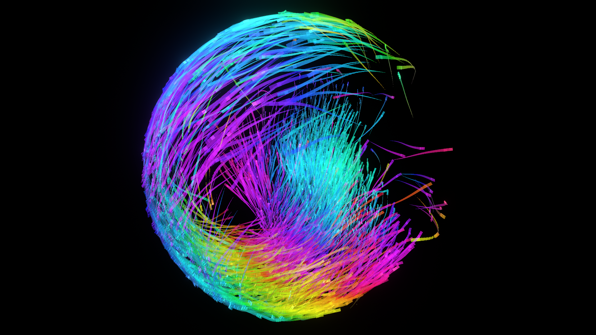

## ECS Boids

An implementation of boids using ECS for Unity 2020

1000 boids implementing the following behaviours:
- Seperation
- Cohesion
- Alignment
- Constrain
- Wander 

There is also a procedural animation and trails implemented using ECS. There are 28K entities being updated every frame getting ~100 FPS and ~80 FPS in VR. See the steamvr branch for a VR implementation 